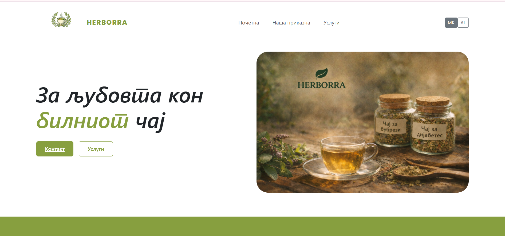
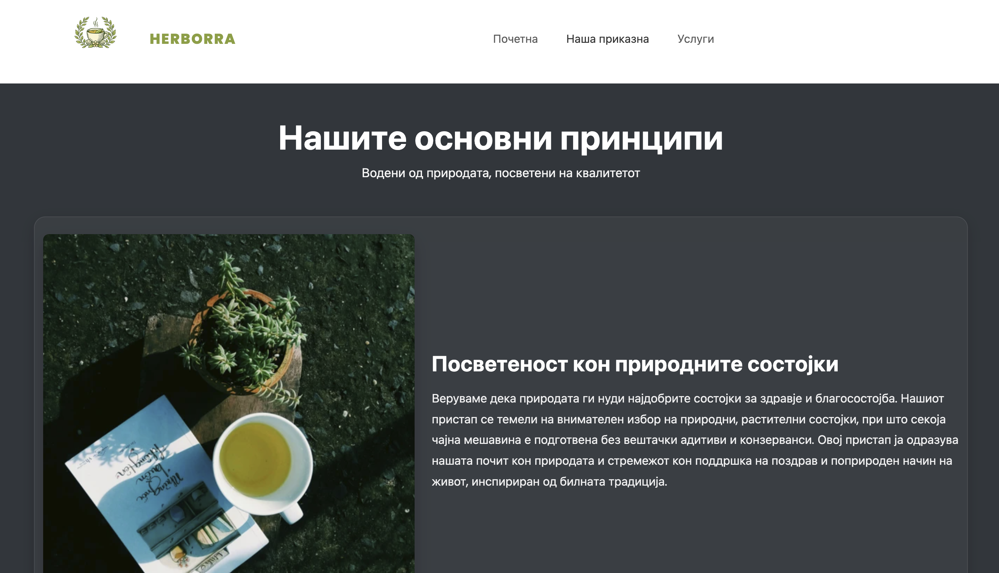

# Herborra - Herbal Tea Website 🌿

Live site: https://herborra.mk/

## Project Overview

Herborra is a single-page Angular application for a herbal tea brand. It focuses on a clean, responsive UI with Macedonian and Albanian language support.

## Key Features

- Responsive layout with Bootstrap and PrimeNG components
- Language switcher (MK/AL) with persisted preference
- SEO meta tags, Open Graph, Twitter cards, and JSON-LD per route
- Hero, Our Story, and Services sections with image assets
- Header and footer with contact details, social links, and Google Maps embed
- Not Found (404) page

## Pages & Sections

- Home (hero + highlights)
- Our Story (core principles)
- Services (products)

## Tech Stack

- Angular 20
- TypeScript
- Bootstrap 5
- PrimeNG + PrimeIcons
- ngx-translate

## Screenshots

