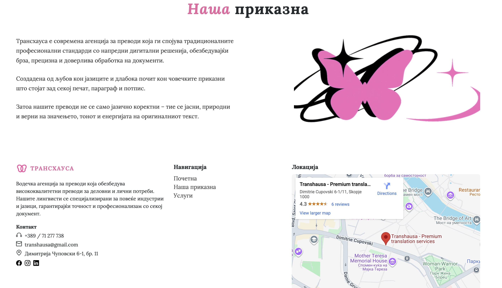

# 🌍 Transhausa - Translation Services

A modern, responsive translation services website built with Angular, focused on presenting services in a clean and user-friendly way.

🔗 Live Demo: https://transhausa.netlify.app

----------------------------------------------------------------------------------------------------------
## ✨ Project Overview

Transhausa is a frontend web application designed to present translation services with a modern UI and smooth user experience.
The project is built as a single-page application (SPA) using Angular v20.

---------------------------------------------------------------------------------------------------------

## 🚀 Key Features

✨ Modern, responsive UI

📱 Mobile-first & cross-browser compatible

🧭 Angular routing for smooth navigation

🌐 Deployed with Netlify (CI/CD)

---------------------------------------------------------------------------------------------------------

🖥️ Pages & Sections

Home - Почетна

Services - Услуги

About us - За нас

--------------------------------------------------------------------------------------------------------
## 🛠️ Tech Stack

- **Framework:** Angular
- **Language:** TypeScript
- **Styling:** Bootstrap
- **Build Tool:** Angular CLI
- **Package Manager:** npm
- **Deployment & CI/CD:** Netlify
-------------------------------------------------------------------------------------------------------
🖼️ Screenshots

